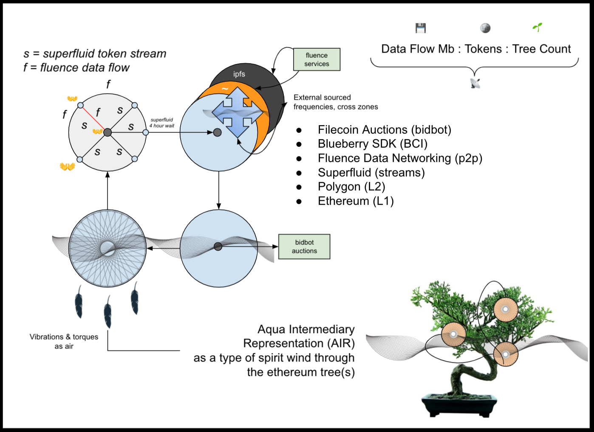
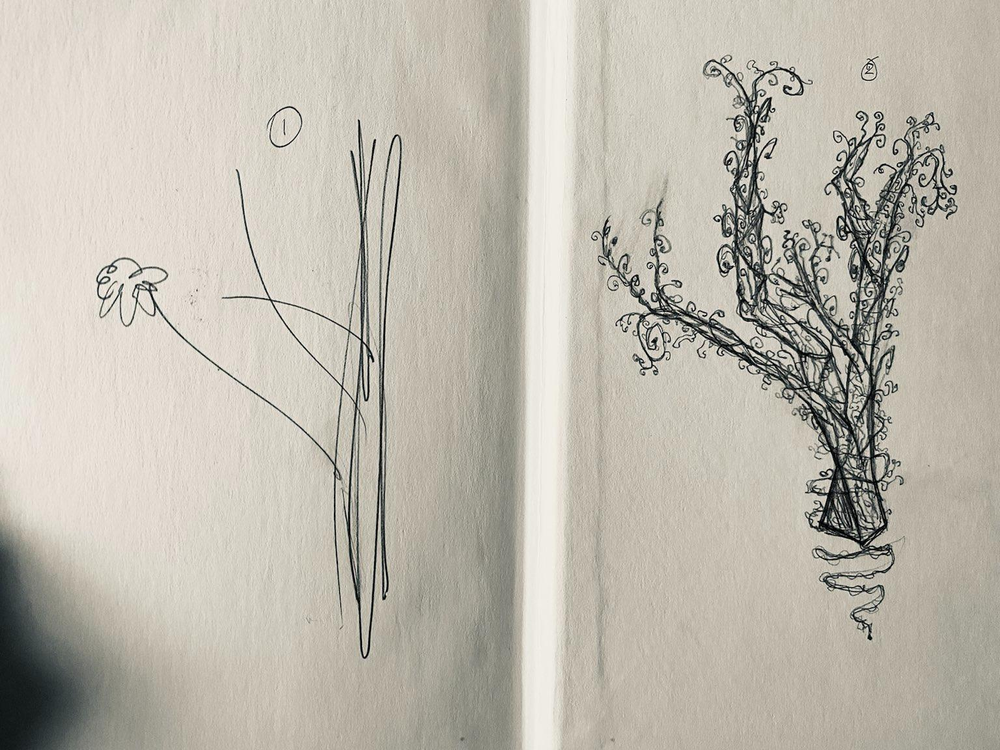

# ethostep
### Hackfs build concept ፊደል

Ethostep is a techno-spiritual collective hastas movement to decentralized audio built to accommodate contiguous cognitive biofeedback aggregation for finding community lockstep rhythm generations for our potentialities of unity seeking in new modes of Vibrational Capitalism

unity-as-a-construction, synchrony-as-the-way, [tune](https://www.youtube.com/watch?v=Rm9hfl9WB9I).

## technolgy stack uses
* Filecoin Auctions (bidbot)
* xbox one kinect
* Blueberry SDK (BCI)
* Fluence Data Networking (p2p)
* Superfluid (streams)
* Polygon (L2)
* Ethereum (L1)

## description

Consider it a type of movement gather zones, that are emitting spiritual energy from frequencies captured. At a central node aggregated the view of said nodes, with some mel-spectrograph. Frequencies can have NFT’s minted as time shots, like onto L2 like polygon. Groups can have unique signatures in aggregate that are published as NFTs, and redeemed by institutions or health authorities that can use said data for bio ip patents, and buybacks on tree counts become constructed based on a data flow volumetric amount. Internet folk gathers can create a type of Reynolds number for the fluidity of sequenced gesture captures, alternating a new type of energy called torques. Auction house deals create Free data storage using the self-hosted bidbot. Then with participation up to a certain point of daata flow, participants gets paid via divident to buyback tree sappling credits benefitted from current filecoin negative pricing.

## f(a||)urther exploration

Specific use cases I might be looking at are: 
* At Home :: gestures or exercises, possibly even tie in elderly community as sometimes physical activity can be difficult, so movement of hands in hastas or other symbolic gesture execution might yield productive and connected hearts and minds
* Local park festivals or meetups :: With heads up displays, Augmented reality or Light Emitting Diodes with color coordination via blueberry light can be mapped, with the same procedure of cycling signs, even conducting in unison around specific culturally significant public trees, whereby future uses become embedded in the data produce, like coptic or feinance etching in artist peices seen through in anthropological history in other items

Placing new significant terms on the word **_Ritual Reality_**, where Phygital (Digital + Physical) NFTs become incorporated into tracke objects of sacred.

  
   

Credit: [Hands On_01](https://opensea.io/assets/0x495f947276749ce646f68ac8c248420045cb7b5e/79340923287578515051916988354893483198355781900529306783424546067081175498753), [Hands On_02](https://opensea.io/assets/0x495f947276749ce646f68ac8c248420045cb7b5e/79340923287578515051916988354893483198355781900529306783424546068180687126529)

As Tesla looked at wireless charging and electrical capacitors as people. Transmitting through the natural medium, the software might be used for conducing an instrumentality of objects and gestures. Pump the planet with audio signals, to generate resource and token distribution from donations at its core. At a theoretical level, think of it as conducting group attention in the format of information of atmospheric charge from group participation. Much to the tune of ‘bring your own algorithm’ the project aims to say, bring your own vibe to the court of ritual gathers. 

## architecture (coming soon)
 todo

## sub-flow-architecture

gather zones / data coops / shuffle mixhop on trust graph
torques
synchrony

## questions & investigates
* every so often a peer connects to another host for a gather based on some weighting calculated at the node
* storage of ethereum addresses in the browser to map to peerids from fluence, to superfluid streams dividend rights token for Initial distribution agreements participants
* perfrom benchmarks and live counter of data capture via flow Mb/s to map to auction house bidbot and intern $0.10 tree with [Eden Reforestation Project](https://edenprojects.org/).

*token for thought: ethereum gas fees be a function of trees planted, more use of 4 hour increment rhythms, more cognition trials, devotion to longer optimism rolled up life cyles, health clock synchrony, tree repair on carbon sequestration, joy exuding activities to powerful sound baths & music orchestration*

## general programming TODOs
* get blueberry data window
* send to aqua script to call
* send particle to marine vm
* in marine vm, compute multiple particle sources together 
*     Re: data & 
*     external frequency source as hz calculation
*     add in layer of point pixel mapping as an accuracy to shape
* every time step x windows, perform a shuffle from the kademlia service, 
* get neighbours and seed random with timestep built-in function
* before every shuffle, perform a snapshot and deploy NFT on polygon
* get all nodes and computer spectrograph overlayed on camera gathers to collate similiarities
* develop trust modules from like spectrographs

## research sourcing

The philosophy this expands on might involve strucralism as a delivery method for combinatorial syncretic cultural influences across networks of peers via various stimulus discriminations. The construction of cyclically driven structures from underlying human phenomena that can be translated and retuned based on declarative topologicaly restructuring. The means by a given tree structures in populations additional rebalancing instrumentality via toolset into more complex and fluid domains of identity memetic potentialities on genetic trees.

In line with goals of increasing the intelligence, health, & lockstep of community coordination, either a shuffle or weighting based system can be implemented to alter the standard gather capacity and orientation. The hope is that greater spectrum coherence can be found in those finding coherent chimera states in frequency levels and group coordination, which down the line may be useful in certain ecological psychology based appreciation of finding alchemical totems or essences to build underlying value affinity structure upon, alongside any financial or environmental gain that might be archived / achieved while under ritual participation.

[MixHop: Higher-Order Graph Convolutional Architectures via Sparsified Neighborhood Mixing](https://arxiv.org/abs/1905.00067)

todo: reach out to SENS Foundation for participation in research aggregation idea and approach for longevity

